<div align="center">

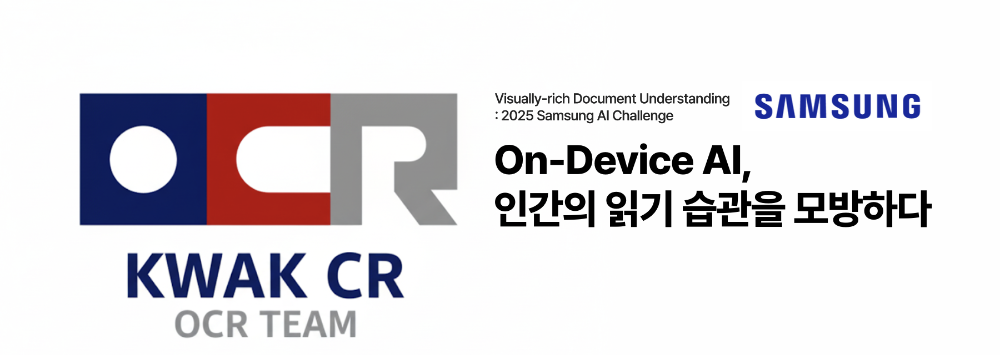

<br><br>

# Visually-rich Document Understanding

### 2025 Samsung AI Challenge | On-Device Document Understanding System

<br>

[](https://python.org)
[](https://pytorch.org)
[](https://github.com/ultralytics/ultralytics)
[](https://github.com/JaidedAI/EasyOCR)
[](https://developer.nvidia.com/cuda-toolkit)
[](https://optuna.org)
[](https://scikit-learn.org)
[](https://creativecommons.org/licenses/by/4.0/)

<br>

> PDF, PPTX, 이미지 등 다양한 형식의 문서에서 **레이아웃 탐지**, **읽기 순서 예측**, **텍스트 추출(OCR)**을 통합 수행하는 경량 멀티모달 문서 이해 파이프라인

</div>

---

## 🏆 Competition Result

<table>
<tr>
<td width="65%" align="center">

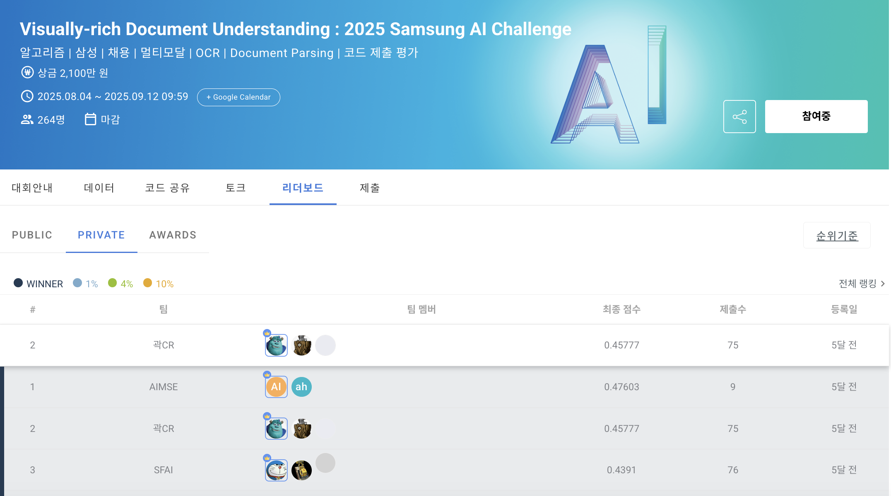

</td>
<td width="35%" align="center">

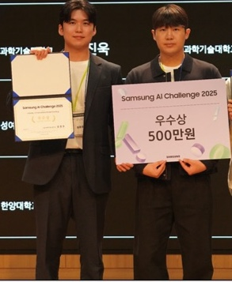

<h3>🥈 Excellence Award</h3>
<h4>(우수상)</h4>
<p>Samsung AI Challenge 2025</p>

</td>
</tr>
</table>

<div align="center">

| 🏅 Achievement | Details |
|:--------------:|:--------|
| **Private Score** | **0.45777** |
| **Final Rank** | 🥈 **2nd / 264 teams** (Top 0.8%) |
| **Prize** | 🏆 **Excellence Award (우수상, 500만원)** |
| Fine-tuned mAP50 | **0.852** |
| Fine-tuned mAP50-95 | **0.701** |
| OCR Speed | Surya OCR 대비 **2.7x** |
| Total Model Size | **221 MB** (On-device deployable) |
| Training Time | ~4h (NVIDIA H200, 61 epochs) |

</div>

---

## 📋 Overview

본 프로젝트는 **2025 삼성 AI 챌린지 Visually-rich Document Understanding** 트랙에 참가하여 개발한 **On-device 문서 이해 시스템**입니다.

기존 OCR 기술은 단순 텍스트 추출에 머물러, 문서의 구조적 레이아웃과 읽기 흐름을 충분히 반영하지 못합니다. 본 시스템은 이 문제를 해결하기 위해 **네 가지 핵심 전략**을 설계하였습니다:

1. 🔄 **적응형 이중 모델 전략** - 세로형/가로형 문서에 따라 최적화된 YOLO 모델을 자동 선택
2. 🛠️ **규칙 기반 후처리** - 반복적 오탐 패턴(중복 박스, Title 오분류, Caption 오탐)을 교정
3. 📖 **구조 기반 읽기 순서 알고리즘** - 인간의 독서 습관을 모방한 3가지 전략 (책/신문/포스터 읽기)
4. ⚡ **경량 OCR 최적화** - EasyOCR + 800 DPI 렌더링으로 속도와 정확도의 균형 달성

---

## 🔄 Pipeline Architecture

시스템은 **6단계 순차 파이프라인**으로 구성되며, Layout Detection의 정확도가 전체 성능의 상한을 결정합니다.

<p align="center">
  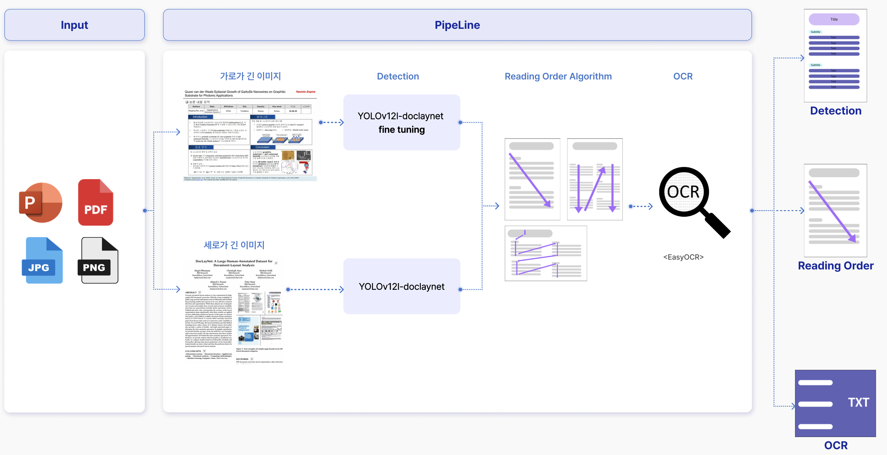
</p>

| Stage | Module | Description | Key Tech |
|:-----:|--------|-------------|----------|
| 1 | **Input** | PDF, PPTX, JPG/PNG 등 다양한 형식의 문서 입력 | - |
| 2 | **Document Conversion** | 문서를 고해상도 이미지로 변환. PDF는 800 DPI 렌더링, PPTX는 LibreOffice -> PDF -> PNG | `pdf2image`, `Poppler` |
| 3 | **Layout Detection** | 문서 방향(세로/가로) 판별 후 최적 YOLO 모델로 6개 클래스 탐지 | `YOLOv12-L`, `Optuna` |
| 4 | **Post-Processing** | NMS, Subtitle->Title 승격, Single Top-Title, Caption 필터링 | Rule-based |
| 5 | **Reading Order** | 문서 유형별 Book / Newspaper / Poster 전략으로 읽기 순서 결정 | `KMeans` |
| 6 | **OCR** | CRAFT 텍스트 탐지 + EasyOCR(한/영) + 10단계 텍스트 클리닝 | `EasyOCR`, `CRAFT` |

---

## 📊 Evaluation Metrics

Samsung AI Challenge 공식 평가는 **세 가지 모듈의 가중합(Weighted Sum)**으로 최종 점수를 산출합니다.

### Final Score

$$S = 0.35 \cdot S_{\text{det}} + 0.35 \cdot S_{\text{ro}} + 0.30 \cdot S_{\text{ocr}}$$

각 모듈은 순차 파이프라인으로 연결되므로, **상위 단계의 오류가 하위 단계 성능에 직접 전파(Error Propagation)**됩니다. 따라서 Layout Detection의 정확도가 전체 시스템 성능의 **상한(Upper Bound)**을 결정합니다.

### Module-wise Metrics

| Module | Weight | Metric | Description |
|--------|:------:|--------|-------------|
| **Layout Detection** | 35% | COCO mAP@[.5:.95] | 예측 박스를 confidence 내림차순 정렬 후, IoU 임계값 0.50~0.95 (0.05 간격)에서 카테고리별 AP를 산출하여 전체 평균 |
| **Reading Order** | 35% | Coverage-weighted NED | GT와 예측을 IoU ≥ 0.5 기준 1:1 매칭 후, 순서 문자열의 Normalized Edit Distance 계산 |
| **OCR** | 30% | 1 - mean(NED) | 매칭된 텍스트 카테고리의 SequenceMatcher 기반 NED 평균 (미매칭 시 NED=1.0 패널티) |

### Sub-score Formulas

**Layout Detection** - COCO-style mAP@[.5:.95]

$$S_{\text{det}} = \frac{1}{|C| \cdot |T|} \sum_{c \in C} \sum_{\theta \in T} AP(c, \theta)$$

> IoU threshold $T = \{0.50, 0.55, \ldots, 0.95\}$, Category $C = \{$title, subtitle, text, table, image, equation$\}$

**Reading Order** - Coverage-weighted NED

$$S_{\text{ro}}^{(d)} = \left(1 - \text{NED}(\mathbf{g},\, \mathbf{p})\right) \times \frac{|\text{matched}|}{|\text{GT}_{\text{RO}}|}$$

> $\mathbf{g}$: GT 순서, $\mathbf{p}$: 예측 순서, Coverage 항은 미매칭 객체에 대한 패널티

**OCR** - 1 - mean(NED)

$$S_{\text{ocr}}^{(d)} = 1 - \frac{1}{N}\sum_{i=1}^{N} \text{NED}\!\left(t_i^{\text{gt}},\, t_i^{\text{pred}}\right)$$

> 텍스트 카테고리(title, subtitle, text) 대상, 매칭 실패 시 NED = 1.0 (최대 패널티)

---

## 🎯 Core Strategies

### 1. Adaptive Dual-Model Strategy

세로형 문서(논문, 보고서)와 가로형 문서(PPT, 포스터)는 레이아웃 구성이 근본적으로 상이합니다. 이 도메인 간극을 해소하기 위해 **문서 방향에 따라 모델을 자동 선택**합니다.

<table>
<tr>
<td width="50%" align="center">

**📄 Portrait (세로형)**

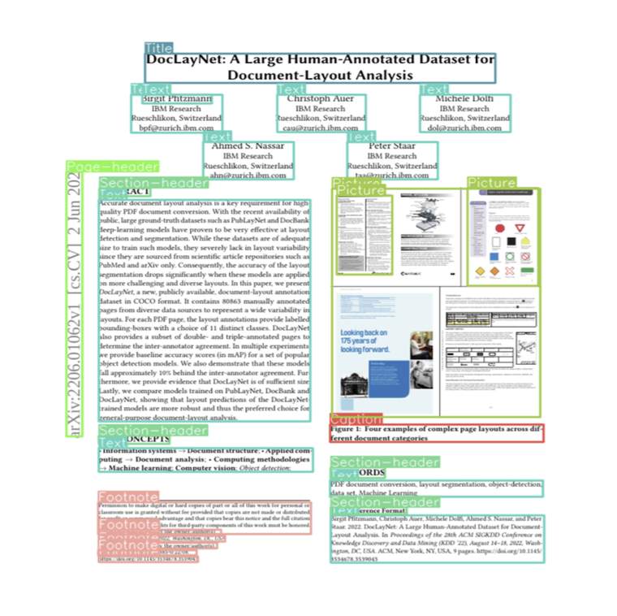

`width <= height` → **YOLOv12-DocLayNet** (Base)

</td>
<td width="50%" align="center">

**🖼️ Landscape (가로형)**

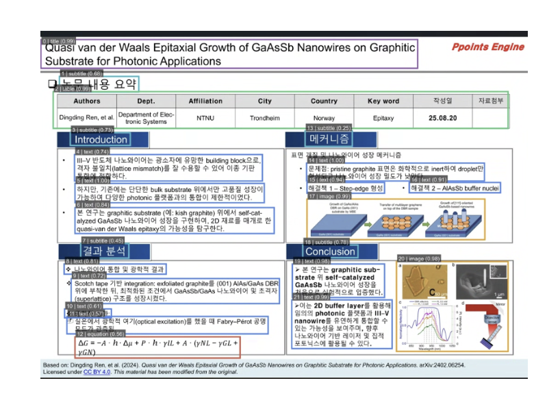

`width > height` or PPTX → **YOLOv12 Fine-tuned** (V5.pt)

</td>
</tr>
</table>

각 모델은 **Optuna**를 활용하여 클래스별 confidence threshold를 대회 점수 기준으로 독립 최적화하였습니다:

| Category | Base Model (세로형) | Fine-tuned Model (가로형) |
|----------|:-------------------:|:-------------------------:|
| Title | 0.15 | 0.45 |
| Subtitle | 0.15 | 0.10 |
| Text | 0.10 | 0.10 |
| Table | 0.10 | 0.10 |
| Equation | 0.10 | 0.10 |
| Image | 0.10 | 0.22 |

### 2. Structure-based Reading Order

의미론적 분석 없이 **레이아웃 구조만으로 인간의 독서 패턴을 모방**하는 3가지 읽기 전략을 설계하였습니다.

<table>
<tr>
<td width="33%" align="center">

**📚 Book-style**

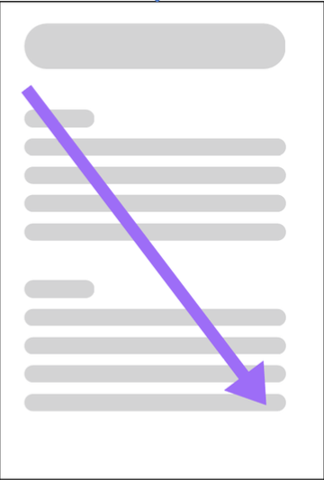

단일 컬럼 문서<br>
y좌표 → x좌표 순 정렬<br>
y-tolerance 기반 라인 그룹핑

</td>
<td width="33%" align="center">

**📰 Newspaper-style**

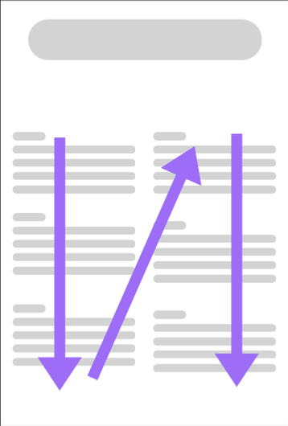

멀티 컬럼 문서<br>
KMeans 클러스터링(k=2,3)<br>
컬럼별 위→아래 순서

</td>
<td width="33%" align="center">

**🪧 Poster Scan-mode**

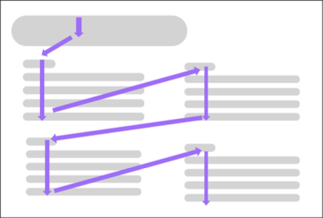

가로형 문서(PPT, 포스터)<br>
Subtitle 행 기준 영역 분할<br>
숫자 접두사 자동 번호순 정렬

</td>
</tr>
</table>

- **📚 Book-style**: 모든 요소를 y좌표 → x좌표 순으로 정렬하고, y-tolerance 기반으로 라인을 그룹핑하여 각 라인 내에서 좌→우로 읽습니다.
- **📰 Newspaper-style**: 페이지 너비의 65% 이상 텍스트 스팬을 감지하여 영역을 분할하고, 각 영역에서 KMeans 클러스터링으로 컬럼을 자동 감지합니다.
- **🪧 Poster Scan-mode**: Subtitle 행을 기준점으로 활용하여 문서를 영역 분할합니다. 각 Subtitle 아래의 세로 스트립을 독립적으로 읽으며, 숫자 접두사("1. 서론")가 있으면 자동으로 번호순 정렬합니다.

### 3. Rule-based Post-processing

모델의 반복적 오류 패턴을 분석하여 **4단계 후처리**를 순차 적용합니다:

| Rule | Description | Parameter | 해결하는 문제 |
|:----:|-------------|-----------|---------------|
| **R1. NMS** | 신뢰도 기준 정렬 후 중복 박스 제거 | IoU = 0.5 | 동일 영역 복수 탐지 |
| **R2. Subtitle → Title** | 낮은 신뢰도의 Subtitle을 Title로 재분류 | conf < 0.80 | Title-Subtitle 오분류 |
| **R3. Single Top-Title** | 최상단-좌측 Title만 유지, 나머지는 Subtitle로 변경 | 페이지당 1개 | 복수 Title 탐지 |
| **R4. Caption Filter** | "Figure X:", "Table X:", "그림", "표" 패턴 매칭 후 제거 | conf < 0.95 | Caption 오탐지 |

### 4. OCR Text Extraction

| Component | Model | Role |
|-----------|-------|------|
| Text Detection | **CRAFT** (craft_mlt_25k.pth) | 문자 영역 인식 기반 텍스트 위치 탐지 |
| Korean Recognition | **korean_g2.pth** | 한국어 텍스트 인식 |
| English Recognition | **english_g2.pth** | 영어 텍스트 인식 |

OCR 추출 후 **10단계 텍스트 클리닝 파이프라인**을 적용합니다:

> NFKC 정규화 → 줄바꿈 통일 → Math/Script 태그 제거 → 하이픈-줄바꿈 병합 → HTML 태그 제거 → 불릿/번호 제거 → 인라인 기호 제거 → 하이픈 분리 단어 병합 → 줄바꿈→공백 → 연속 공백 정리

---

## 📁 Dataset

> 학습 데이터셋은 **자체 구축**하였으며, 대회 제공 PPT, 자체 제작 포스터, 외부 수집 데이터를 결합하여 구성하였습니다.

| 항목 | 내용 |
|:----:|------|
| **데이터 소스** | NeurIPS 2024 학술 포스터 |
| **구성** | 대회 제공 PPT + 자체 제작 포스터 21장 + 외부 수집 79장 |
| **총 이미지** | 100장 |
| **어노테이션 도구** | Roboflow |
| **어노테이션 형식** | YOLO Detection Format (bbox + class) |
| **이미지 해상도** | 1123×794 ~ 5120×2880 (가변) |
| **라이선스** | CC BY 4.0 |
| **데이터 분할** | Train 90장 (90%) / Validation 10장 (10%) |

### Detection Classes (6 Classes)

| Class | YOLO ID | Description | Example |
|:-----:|:-------:|-------------|---------|
| `title` | 5 | 문서 제목 | 논문/포스터의 메인 제목 |
| `subtitle` | 2 | 섹션 헤더 | "1. Introduction", "Methods" |
| `text` | 4 | 본문 텍스트 | 단락, 설명문 |
| `table` | 3 | 표 | 실험 결과 표, 데이터 테이블 |
| `image` | 1 | 이미지/그림 | 다이어그램, 사진, 그래프 |
| `equation` | 0 | 수식 | 수학 공식, 방정식 |

---

## 🚀 Training & Results

### Fine-tuning Configuration

| Parameter | Value | Rationale |
|-----------|:-----:|-----------|
| Base Model | YOLOv12-Large (DocLayNet pretrained) | 문서 도메인 사전지식 활용 |
| Input Size | 1024 × 1024 | 고해상도 요소 탐지 |
| Batch Size | 16 | GPU 메모리 최적 활용 |
| Max Epochs | 300 (Early Stop at 61) | Patience=50으로 과적합 방지 |
| LR Schedule | Cosine Annealing (0.01 → 0.0001) | 안정적 수렴 |
| Augmentation | Mosaic 0.2, Scale ±20%, Translation ±5% | 문서 구조 보존 보수적 증강 |
| Flip / Rotation | **OFF** | 텍스트 방향/읽기 순서 보존 |

### Performance

<p align="center">
  
</p>

**Module-wise Ablation Study:**

| Step | Setting | Public Score | Improvement |
|:----:|---------|:-----------:|:-----------:|
| 1 | Baseline (Surya OCR) | 0.1168 | - |
| 2 | + YOLOv12-DocLayNet | 0.1515 | +29.7% |
| 3 | + Rule-based Post-processing | 0.2243 | +48.0% |
| 4 | + Fine-tuning (V5.pt) | 0.2828 | +26.1% |
| 5 | + Optuna Threshold | 0.3285 | +16.2% |
| 6 | + Reading Order Strategies | 0.4320 | +31.5% |
| **7** | **+ EasyOCR + Text Cleaning** | **0.4577** | **+5.9%** |

---

## 🧰 Tech Stack

### Frameworks & Libraries

| Category | Tool | Version | Role |
|:--------:|------|:-------:|------|
| **Deep Learning** | PyTorch | 2.5.1+cu121 | 딥러닝 프레임워크 |
| **Detection** | Ultralytics (YOLOv12) | 8.3.185 | 문서 레이아웃 탐지 |
| **OCR** | EasyOCR | 1.7.2 | 한/영 다국어 텍스트 인식 |
| **Text Detection** | CRAFT | - | 문자 영역 탐지 |
| **Clustering** | scikit-learn | 1.7.1 | KMeans 멀티컬럼 감지 |
| **Optimization** | Optuna | - | 신뢰도 임계값 자동 최적화 |
| **Document** | pdf2image | 1.17.0 | PDF → 이미지 변환 |
| **Image** | Pillow | 11.3.0 | 이미지 처리 및 시각화 |
| **Data** | pandas | 2.3.2 | CSV 데이터 핸들링 |
| **Numeric** | NumPy | 2.2.6 | 수치 연산 |
| **Annotation** | Roboflow | - | 데이터셋 어노테이션 |

### Training Environment

| Item | Specification |
|:----:|---------------|
| GPU | NVIDIA HGX H200 |
| CUDA | 12.1 |
| Training Time | ~4 hours (61 epochs, Early Stopped from 300) |
| Total Model Size | 221 MB (On-device deployable) |

---

## ⚡ Quick Start

### 1. Environment Setup

```bash
pip install -r requirements.txt
```

### 2. Training (Fine-tuning)

```bash
python scripts/train.py
```

주요 학습 설정은 `scripts/train.py` 상단의 CONFIG 블록에서 수정할 수 있습니다:
- `SPLIT_RATIOS`: 데이터 분할 비율 (기본: 90/10/0)
- `EPOCHS`, `BATCH`, `IMGSZ`: 학습 하이퍼파라미터
- `MOSAIC`, `SCALE`, `TRANSLATE`: 데이터 증강 설정

### 3. Inference

```bash
python scripts/inference.py
```

결과는 `outputs/submission.csv`로 저장됩니다. 출력 형식:

```csv
ID, category_type, confidence_score, order, text, bbox
doc1, title, 0.95, 0, "Attention Is All You Need", "10, 20, 500, 80"
doc1, text, 0.88, 1, "We propose a new simple network...", "10, 100, 500, 300"
```

---

## 📂 Project Structure

```
.
├── assets/                     # README 이미지 리소스
│
├── configs/                    # 설정 파일
│   ├── data.yaml               #   YOLO 데이터셋 설정
│   ├── dataset_info.txt        #   데이터셋 설명
│   └── roboflow_info.txt       #   Roboflow 어노테이션 정보
│
├── data/                       # 데이터셋 (자체 구축)
│   ├── raw/                    #   원본 데이터 (100 포스터 이미지 + YOLO 라벨)
│   │   ├── images/
│   │   └── labels/
│   ├── visualized/             #   BBox 시각화 샘플
│   ├── dataset_metadata.csv    #   데이터셋 메타 정보
│   └── data_license.csv        #   데이터 라이선스
│
├── models/                     # 모델 가중치
│   ├── pretrained/             #   사전학습 모델 (4개)
│   │   ├── yolov12l-doclaynet.pt
│   │   ├── craft_mlt_25k.pth
│   │   ├── english_g2.pth
│   │   └── korean_g2.pth
│   └── finetuned/              #   파인튜닝 모델 (3개)
│       ├── V5.pt               #   최종 제출 모델 (mAP50=0.852)
│       ├── best.pt
│       └── last.pt
│
├── scripts/                    # 실행 스크립트
│   ├── train.py                #   학습 (YOLOv12 Fine-tuning)
│   ├── inference.py            #   추론 (Detection + OCR + Reading Order)
│   ├── generate_figures.py     #   README 이미지 생성
│   └── draw_pipeline.py        #   논문용 파이프라인 시각화
│
├── experiments/                # 학습 실험 로그
│   └── train_6cls_1024/        #   메인 실험 결과
│
├── docs/                       # 문서
│   ├── paper_draft.md          #   기술 논문 초안
│   ├── overleaf_paper/         #   LaTeX 논문 소스
│   └── solution_report.pdf     #   솔루션 보고서
│
├── requirements.txt            # Python 의존성
└── .gitignore
```

---

## 📄 Technical Paper

> 본 프로젝트의 전체 방법론, 실험 설계, 결과 분석을 정리한 기술 논문입니다.

<details>
<summary><b>📖 Click to view Technical Paper (9 pages)</b></summary>

<br>

<div align="center">

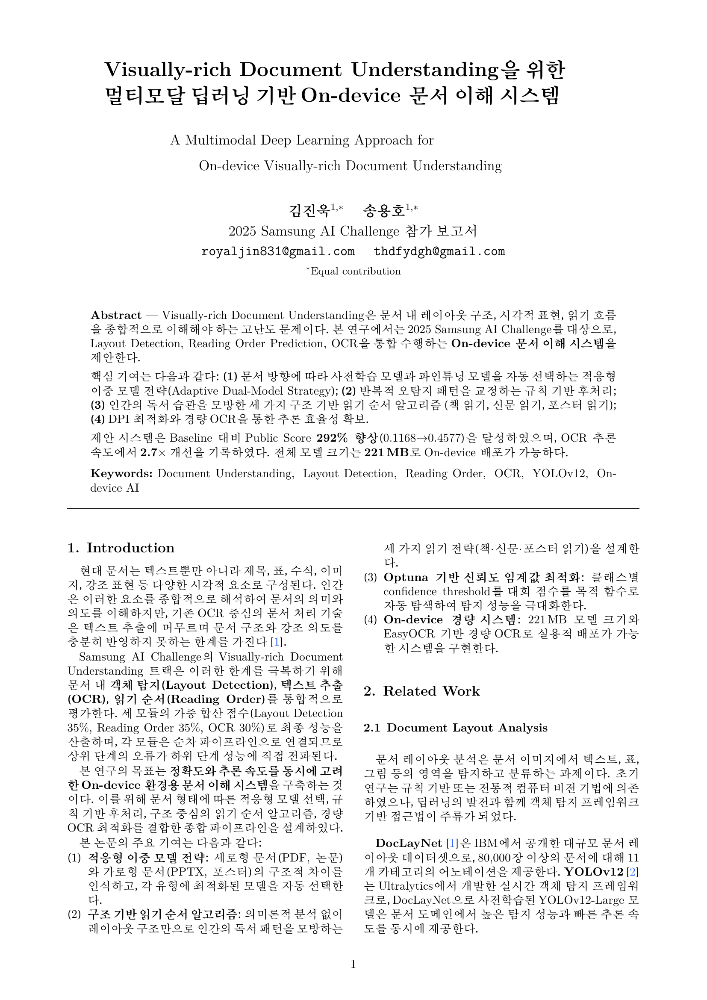

---

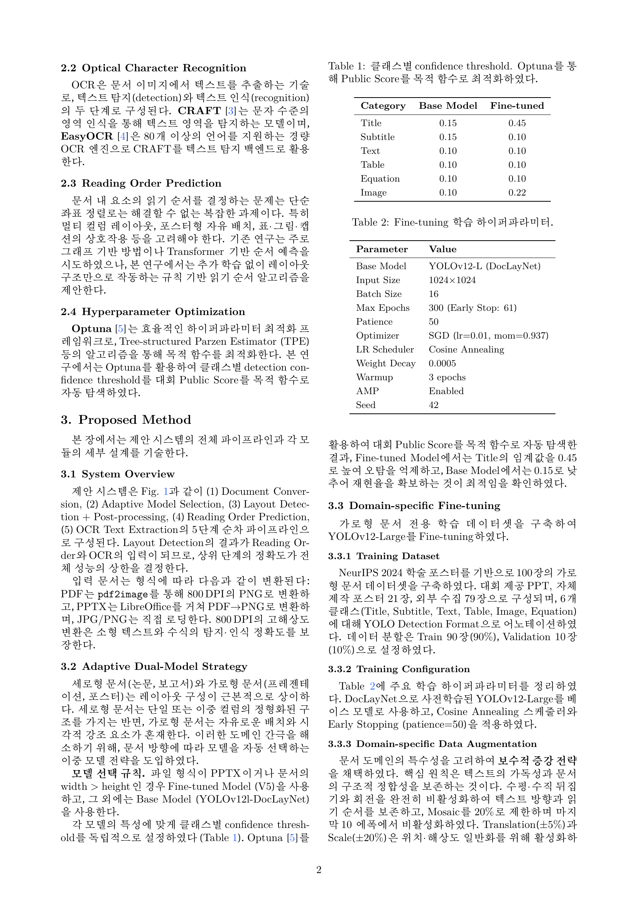

---

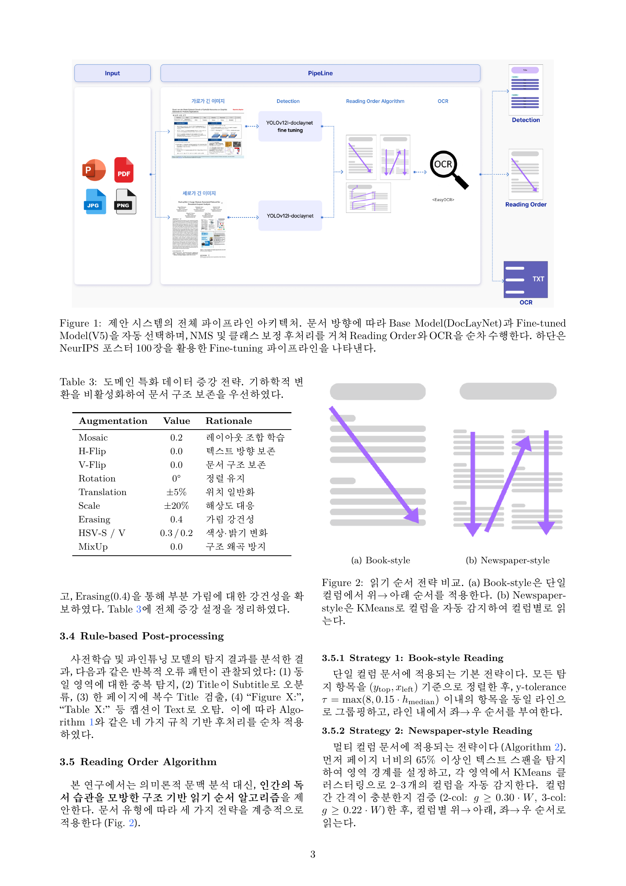

---

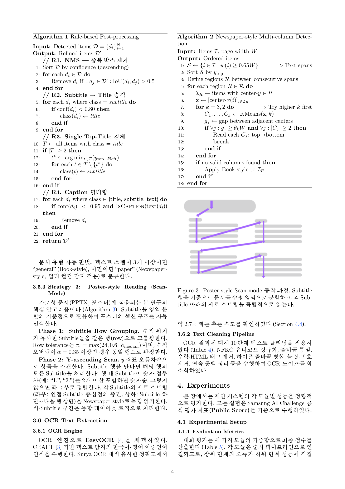

---

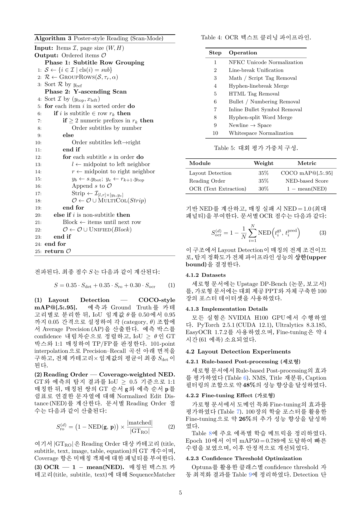

---

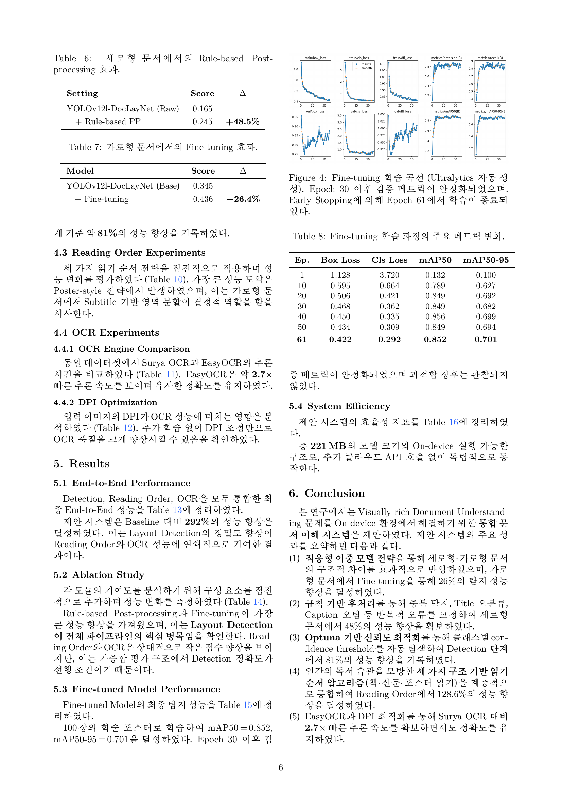

---

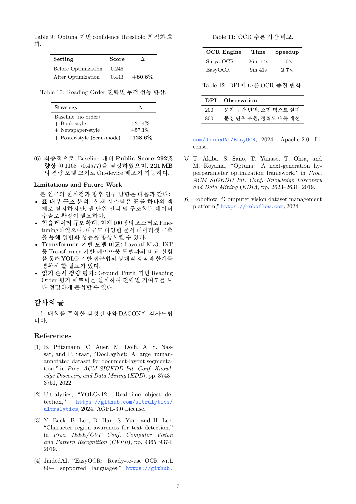

---

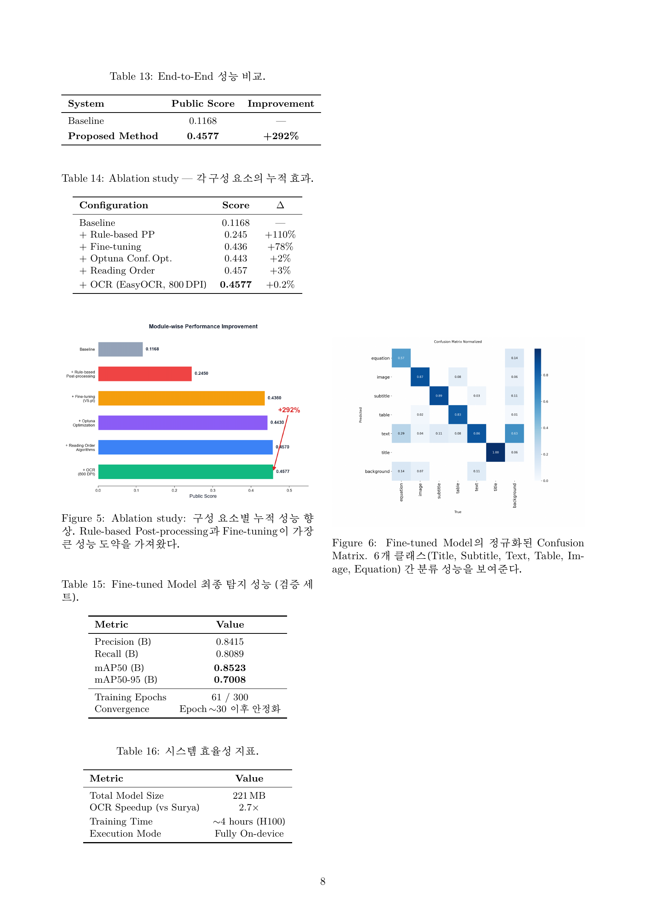

---

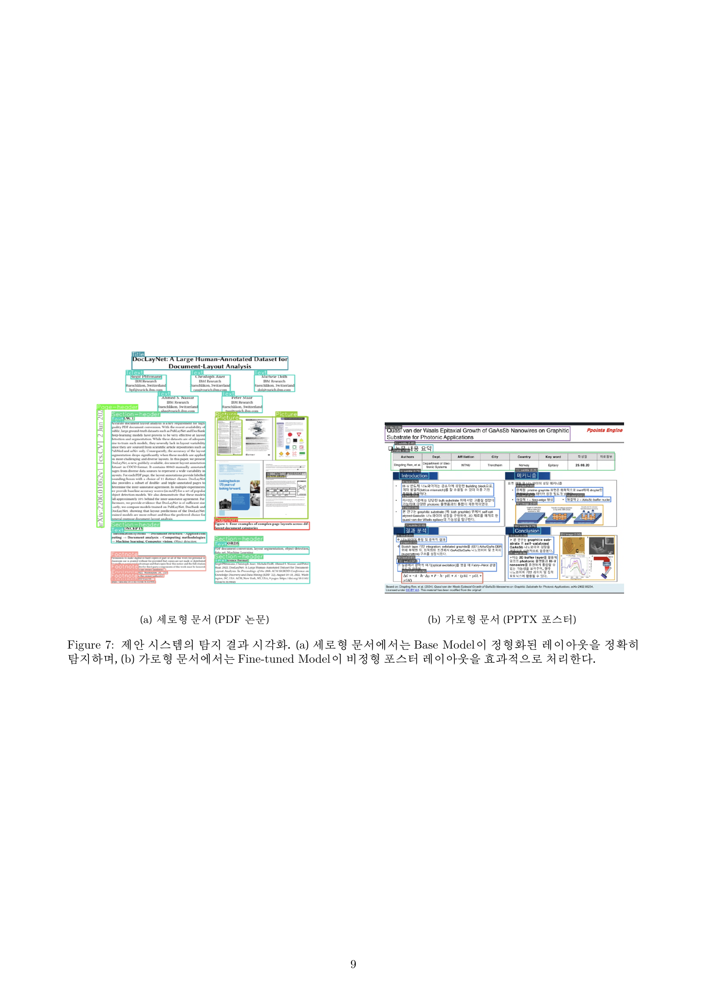

</div>

</details>

---

## 📜 Model Licenses

| Model | License | Source |
|-------|:-------:|--------|
| YOLOv12 (Ultralytics) | AGPL-3.0 | [ultralytics/ultralytics](https://github.com/ultralytics/ultralytics) |
| YOLOv12-DocLayNet | AGPL-3.0 | [hantian/yolo-doclaynet](https://huggingface.co/hantian/yolo-doclaynet) |
| CRAFT (Text Detection) | Apache-2.0 | [clovaai/CRAFT-pytorch](https://github.com/clovaai/CRAFT-pytorch) |
| EasyOCR (Korean/English) | Apache-2.0 | [JaidedAI/EasyOCR](https://github.com/JaidedAI/EasyOCR) |
| Fine-tuning Dataset | CC BY 4.0 | Self-built (Roboflow annotated) |

---

## 📚 References

1. Ultralytics. *YOLOv12: Real-time Object Detection.* AGPL-3.0. https://github.com/ultralytics/ultralytics
2. B. Pfitzmann et al. *DocLayNet: A Large Human-Annotated Dataset for Document-Layout Segmentation.* KDD, 2022.
3. Y. Baek et al. *Character Region Awareness for Text Detection.* CVPR, 2019.
4. JaidedAI. *EasyOCR: Ready-to-use OCR with 80+ Supported Languages.* Apache-2.0. https://github.com/JaidedAI/EasyOCR
5. T. Akiba et al. *Optuna: A Next-generation Hyperparameter Optimization Framework.* KDD, 2019.

---

<div align="center">

### 🏆 Samsung AI Challenge 2025 - Excellence Award 🏆

[](https://github.com/jinnwoook)

</div>
