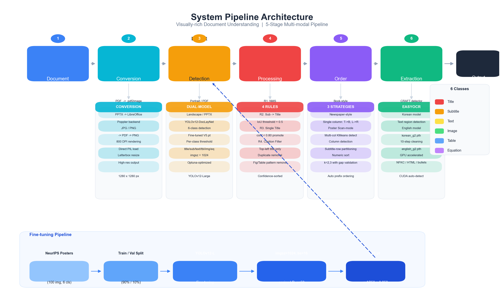
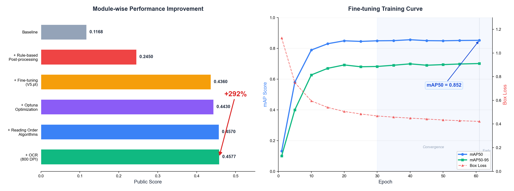

# Visually-rich Document Understanding

### 2025 Samsung AI Challenge | On-device Document Understanding System

> PDF, PPTX, 이미지 등 다양한 형식의 문서에서 **레이아웃 탐지**, **읽기 순서 예측**, **텍스트 추출(OCR)**을 통합 수행하는 멀티모달 문서 이해 파이프라인

---

## Overview

본 프로젝트는 **2025 삼성 AI 챌린지 Visually-rich Document Understanding** 트랙에 참가하여 개발한 **On-device 문서 이해 시스템**입니다.

기존 OCR 기술은 단순 텍스트 추출에 머물러, 문서의 구조적 레이아웃과 읽기 흐름을 충분히 반영하지 못합니다. 본 시스템은 이 문제를 해결하기 위해 다음 네 가지 핵심 전략을 설계하였습니다:

1. **적응형 이중 모델 전략** - 세로형/가로형 문서에 따라 최적화된 YOLO 모델을 자동 선택
2. **규칙 기반 후처리** - 반복적 오탐 패턴(중복 박스, Title 오분류, Caption 오탐)을 교정
3. **구조 기반 읽기 순서 알고리즘** - 인간의 독서 습관을 모방한 3가지 전략 (책/신문/포스터 읽기)
4. **경량 OCR 최적화** - EasyOCR + 800 DPI 렌더링으로 속도와 정확도의 균형 달성

### Key Results

| Metric | Value |
|--------|-------|
| **Public Score** | **0.4577** (Baseline 0.1168 대비 **+292%**) |
| Fine-tuned mAP50 | **0.852** |
| Fine-tuned mAP50-95 | **0.701** |
| OCR 속도 개선 | Surya OCR 대비 **2.7x** |
| 총 모델 크기 | **221 MB** (On-device 배포 가능) |
| 학습 시간 | ~4시간 (NVIDIA H200, 61 epochs) |

---

## Pipeline Architecture

시스템은 6단계 순차 파이프라인으로 구성되며, Layout Detection의 정확도가 전체 성능의 상한을 결정합니다.

<p align="center">
  
</p>

각 단계의 상세 내용은 아래와 같습니다:

| Stage | Module | Description | Key Tech |
|:-----:|--------|-------------|----------|
| 1 | **Input** | PDF, PPTX, JPG/PNG 등 다양한 형식의 문서 입력 | - |
| 2 | **Document Conversion** | 문서를 고해상도 이미지로 변환. PDF는 800 DPI로 렌더링, PPTX는 LibreOffice를 거쳐 PDF로 변환 후 PNG 추출 | pdf2image, Poppler |
| 3 | **Layout Detection** | 문서 방향(세로/가로)을 판별하여 Base 모델 또는 Fine-tuned 모델로 6개 클래스의 레이아웃 요소 탐지. 1280x1280 리사이즈 후 imgsz=1024로 추론 | YOLOv12-L, Optuna |
| 4 | **Post-Processing** | NMS, Subtitle->Title 승격, Single Top-Title 강제, Caption 패턴 필터링 등 4단계 규칙 기반 후처리 | Rule-based |
| 5 | **Reading Order** | 문서 유형에 따라 Book-style, Newspaper-style, Poster Scan-mode 중 최적 전략을 선택하여 읽기 순서 결정 | KMeans Clustering |
| 6 | **OCR + Text Extraction** | CRAFT 텍스트 탐지 + EasyOCR(한/영) 텍스트 인식 + 10단계 텍스트 클리닝 파이프라인 | EasyOCR, CRAFT |

---

## Core Strategies

### 1. Adaptive Dual-Model Strategy (적응형 이중 모델 전략)

세로형 문서(논문, 보고서)와 가로형 문서(PPT, 포스터)는 레이아웃 구성이 근본적으로 상이합니다. 세로형은 단일/이중 컬럼의 정형화된 구조를, 가로형은 자유로운 배치와 시각적 강조 요소가 혼재합니다. 이 도메인 간극을 해소하기 위해 문서 방향에 따라 모델을 자동 선택합니다.

| 문서 유형 | 선택 조건 | 사용 모델 | 특화 영역 |
|-----------|-----------|-----------|-----------|
| 세로형 (PDF, 논문) | `width <= height` | **YOLOv12-DocLayNet** (Base) | 정형화된 문서 레이아웃 |
| 가로형 (PPTX, 포스터) | `width > height` 또는 PPTX | **YOLOv12 Fine-tuned** (V5.pt) | 비정형 포스터/프레젠테이션 |

각 모델은 Optuna를 활용하여 클래스별 confidence threshold를 대회 점수 기준으로 독립 최적화하였습니다:

| Category | Base Model (세로형) | Fine-tuned Model (가로형) |
|----------|:-------------------:|:-------------------------:|
| Title | 0.15 | 0.45 |
| Subtitle | 0.15 | 0.10 |
| Text | 0.10 | 0.10 |
| Table | 0.10 | 0.10 |
| Equation | 0.10 | 0.10 |
| Image | 0.10 | 0.22 |

### 2. Structure-based Reading Order (구조 기반 읽기 순서)

의미론적 분석 없이 **레이아웃 구조만으로 인간의 독서 패턴을 모방**하는 3가지 읽기 전략을 설계하였습니다. 문서 유형에 따라 계층적으로 적용합니다.

<p align="center">
  
</p>

**Book-style** (단일 컬럼): 모든 요소를 y좌표 -> x좌표 순으로 정렬하고, y-tolerance 기반으로 라인을 그룹핑하여 각 라인 내에서 좌->우로 읽습니다.

**Newspaper-style** (멀티 컬럼): 페이지 너비의 65% 이상인 텍스트 스팬을 감지하여 영역을 분할하고, 각 영역에서 KMeans 클러스터링(k=2,3)으로 컬럼을 자동 감지합니다. 컬럼별로 위->아래 순서로 읽습니다.

**Poster Scan-mode** (가로형): Subtitle 행을 기준점으로 활용하여 문서를 영역 분할합니다. 각 Subtitle 아래의 세로 스트립을 독립적으로 읽으며, 숫자 접두사("1. 서론", "2. 방법")가 있으면 자동으로 번호순 정렬합니다.

### 3. Rule-based Post-processing (규칙 기반 후처리)

모델의 반복적 오류 패턴을 분석하여 4단계 후처리를 순차 적용합니다:

| Rule | Description | Parameter | 해결하는 문제 |
|------|-------------|-----------|---------------|
| **R1. NMS** | 신뢰도 기준 정렬 후 중복 박스 제거 | IoU = 0.5 | 동일 영역 복수 탐지 |
| **R2. Subtitle -> Title** | 낮은 신뢰도의 Subtitle을 Title로 재분류 | conf < 0.80 | Title-Subtitle 오분류 |
| **R3. Single Top-Title** | 최상단-좌측 Title만 유지, 나머지는 Subtitle로 변경 | 페이지당 1개 | 복수 Title 탐지 |
| **R4. Caption Filter** | "Figure X:", "Table X:", "그림", "표" 패턴 매칭 후 제거 | conf < 0.95 | Caption 오탐지 |

### 4. OCR Text Extraction (텍스트 추출)

| Component | Model | Role |
|-----------|-------|------|
| Text Detection | **CRAFT** (craft_mlt_25k.pth) | 문자 영역 인식 기반 텍스트 위치 탐지 |
| Korean Recognition | **korean_g2.pth** | 한국어 텍스트 인식 |
| English Recognition | **english_g2.pth** | 영어 텍스트 인식 |

OCR 추출 후 **10단계 텍스트 클리닝 파이프라인**을 적용합니다:

> NFKC 정규화 -> 줄바꿈 통일 -> Math/Script 태그 제거 -> 하이픈-줄바꿈 병합 -> HTML 태그 제거 -> 불릿/번호 제거 -> 인라인 기호 제거 -> 하이픈 분리 단어 병합 -> 줄바꿈->공백 -> 연속 공백 정리

---

## Dataset

> 학습 데이터셋은 **자체 구축**하였으며, 대회 제공 PPT, 자체 제작 포스터, 외부 수집 데이터를 결합하여 구성하였습니다.

| 항목 | 내용 |
|------|------|
| **데이터 소스** | NeurIPS 2024 학술 포스터 |
| **구성** | 대회 제공 PPT + 자체 제작 포스터 21장 + 외부 수집 79장 |
| **총 이미지** | 100장 |
| **어노테이션 도구** | Roboflow |
| **어노테이션 형식** | YOLO Detection Format (bbox + class) |
| **이미지 해상도** | 1123x794 ~ 5120x2880 (가변) |
| **라이선스** | CC BY 4.0 |
| **데이터 분할** | Train 90장 (90%) / Validation 10장 (10%) |

### Detection Classes (6 Classes)

| Class | YOLO ID | Description | Example |
|-------|:-------:|-------------|---------|
| `title` | 5 | 문서 제목 | 논문/포스터의 메인 제목 |
| `subtitle` | 2 | 섹션 헤더 | "1. Introduction", "Methods" |
| `text` | 4 | 본문 텍스트 | 단락, 설명문 |
| `table` | 3 | 표 | 실험 결과 표, 데이터 테이블 |
| `image` | 1 | 이미지/그림 | 다이어그램, 사진, 그래프 |
| `equation` | 0 | 수식 | 수학 공식, 방정식 |

---

## Training & Results

### Fine-tuning Configuration

| Parameter | Value | Rationale |
|-----------|-------|-----------|
| Base Model | YOLOv12-Large (DocLayNet pretrained) | 문서 도메인 사전지식 활용 |
| Input Size | 1024 x 1024 | 고해상도 요소 탐지 |
| Batch Size | 16 | GPU 메모리 최적 활용 |
| Max Epochs | 300 (Early Stop at 61) | Patience=50으로 과적합 방지 |
| LR Schedule | Cosine Annealing (0.01 -> 0.0001) | 안정적 수렴 |
| Augmentation | Mosaic 0.2, Scale +-20%, Translation +-5% | 문서 구조 보존 보수적 증강 |
| Flip / Rotation | **OFF** | 텍스트 방향/읽기 순서 보존 |

### Performance

<p align="center">
  
</p>

**Fine-tuning 학습 곡선**: Epoch 30 이후 검증 메트릭이 안정화되었으며, Epoch 61에서 Early Stopping이 작동하였습니다. 최종 mAP50 = **0.852**, mAP50-95 = **0.701**을 달성하였습니다.

**Module-wise 성능 향상**: 각 모듈을 점진적으로 추가하며 평가한 결과, Baseline(0.1168) 대비 최종 시스템(0.4577)이 **292%** 향상되었습니다. 가장 큰 기여는 Fine-tuning(+78%)과 Rule-based Post-processing(+110%)이었습니다.

| Module | Key Improvement | Main Factor |
|--------|:---------------:|-------------|
| Layout Detection | **+48%** (후처리), **+26%** (Fine-tuning), **+81%** (Optuna) | 적응형 모델 선택 + 임계값 최적화 |
| Reading Order | **+128.6%** (전략 통합) | Poster Scan-mode 알고리즘 |
| OCR | **2.7x** 속도 향상 | EasyOCR + DPI 800 최적화 |

---

## Tech Stack

### Frameworks & Libraries

| Category | Tool | Version | Role |
|----------|------|---------|------|
| **Deep Learning** | PyTorch | 2.5.1+cu121 | 딥러닝 프레임워크 |
| **Detection** | Ultralytics (YOLOv12) | 8.3.185 | 문서 레이아웃 탐지 |
| **OCR** | EasyOCR | 1.7.2 | 한/영 다국어 텍스트 인식 |
| **Text Detection** | CRAFT | - | 문자 영역 탐지 |
| **Clustering** | scikit-learn | 1.7.1 | KMeans 멀티컬럼 감지 |
| **Optimization** | Optuna | - | 신뢰도 임계값 자동 최적화 |
| **Document** | pdf2image | 1.17.0 | PDF -> 이미지 변환 |
| **Image** | Pillow | 11.3.0 | 이미지 처리 및 시각화 |
| **Data** | pandas | 2.3.2 | CSV 데이터 핸들링 |
| **Numeric** | NumPy | 2.2.6 | 수치 연산 |
| **Annotation** | Roboflow | - | 데이터셋 어노테이션 |

### Training Environment

| Item | Specification |
|------|---------------|
| GPU | NVIDIA HGX H200 |
| CUDA | 12.1 |
| Training Time | ~4 hours (61 epochs, Early Stopped from 300) |
| Total Model Size | 221 MB (On-device deployable) |

---

## Quick Start

### 1. Environment Setup

```bash
pip install -r requirements.txt
```

### 2. Training (Fine-tuning)

```bash
python scripts/train.py
```

주요 학습 설정은 `scripts/train.py` 상단의 CONFIG 블록에서 수정할 수 있습니다:
- `SPLIT_RATIOS`: 데이터 분할 비율 (기본: 90/10/0)
- `EPOCHS`, `BATCH`, `IMGSZ`: 학습 하이퍼파라미터
- `MOSAIC`, `SCALE`, `TRANSLATE`: 데이터 증강 설정

### 3. Inference

```bash
python scripts/inference.py
```

결과는 `outputs/submission.csv`로 저장됩니다. 출력 형식:

```csv
ID, category_type, confidence_score, order, text, bbox
doc1, title, 0.95, 0, "Attention Is All You Need", "10, 20, 500, 80"
doc1, text, 0.88, 1, "We propose a new simple network...", "10, 100, 500, 300"
```

---

## Project Structure

```
.
├── assets/                     # README 이미지 리소스
│   ├── pipeline_architecture.png
│   ├── performance_results.png
│   └── reading_order_strategies.png
│
├── configs/                    # 설정 파일
│   ├── data.yaml               #   YOLO 데이터셋 설정
│   ├── dataset_info.txt        #   데이터셋 설명
│   └── roboflow_info.txt       #   Roboflow 어노테이션 정보
│
├── data/                       # 데이터셋 (자체 구축)
│   ├── raw/                    #   원본 데이터 (100 포스터 이미지 + YOLO 라벨)
│   │   ├── images/
│   │   └── labels/
│   ├── visualized/             #   BBox 시각화 샘플
│   ├── dataset_metadata.csv    #   데이터셋 메타 정보
│   └── data_license.csv        #   데이터 라이선스
│
├── models/                     # 모델 가중치
│   ├── pretrained/             #   사전학습 모델 (4개)
│   │   ├── yolov12l-doclaynet.pt   # YOLOv12-L (DocLayNet pretrained)
│   │   ├── craft_mlt_25k.pth      # CRAFT 텍스트 탐지
│   │   ├── english_g2.pth         # EasyOCR 영어 모델
│   │   └── korean_g2.pth          # EasyOCR 한국어 모델
│   └── finetuned/              #   파인튜닝 모델 (3개)
│       ├── V5.pt                   # 최종 제출 모델 (mAP50=0.852)
│       ├── best.pt                 # 최고 성능 체크포인트
│       └── last.pt                 # 마지막 에폭 체크포인트
│
├── scripts/                    # 실행 스크립트
│   ├── train.py                #   학습 코드 (YOLOv12 Fine-tuning)
│   ├── inference.py            #   추론 코드 (Detection + OCR + Reading Order)
│   ├── generate_figures.py     #   README 이미지 생성
│   └── draw_pipeline.py        #   논문용 파이프라인 시각화
│
├── experiments/                # 학습 실험 로그
│   ├── train_6cls_1024/        #   메인 실험 결과 (confusion matrix, curves 등)
│   └── train_6cls_1024_v2/     #   2차 실험 결과
│
├── docs/                       # 문서
│   ├── paper_draft.md          #   기술 논문 초안
│   ├── paper_summary.md        #   관련 연구 정리
│   ├── overleaf_paper/         #   LaTeX 논문 소스
│   ├── environment.txt         #   실행 환경 정보 (conda + GPU)
│   └── solution_report.pdf     #   솔루션 보고서
│
├── requirements.txt            # Python 의존성
└── .gitignore
```

---

## Model Licenses

| Model | License | Source |
|-------|---------|--------|
| YOLOv12 (Ultralytics) | AGPL-3.0 | [ultralytics/ultralytics](https://github.com/ultralytics/ultralytics) |
| YOLOv12-DocLayNet | AGPL-3.0 | [hantian/yolo-doclaynet](https://huggingface.co/hantian/yolo-doclaynet) |
| CRAFT (Text Detection) | Apache-2.0 | [clovaai/CRAFT-pytorch](https://github.com/clovaai/CRAFT-pytorch) |
| EasyOCR (Korean/English) | Apache-2.0 | [JaidedAI/EasyOCR](https://github.com/JaidedAI/EasyOCR) |
| Fine-tuning Dataset | CC BY 4.0 | Self-built (Roboflow annotated) |

---

## References

1. Ultralytics. *YOLOv12: Real-time Object Detection.* AGPL-3.0. https://github.com/ultralytics/ultralytics
2. B. Pfitzmann et al. *DocLayNet: A Large Human-Annotated Dataset for Document-Layout Segmentation.* KDD, 2022.
3. Y. Baek et al. *Character Region Awareness for Text Detection.* CVPR, 2019.
4. JaidedAI. *EasyOCR: Ready-to-use OCR with 80+ Supported Languages.* Apache-2.0. https://github.com/JaidedAI/EasyOCR
5. T. Akiba et al. *Optuna: A Next-generation Hyperparameter Optimization Framework.* KDD, 2019.
